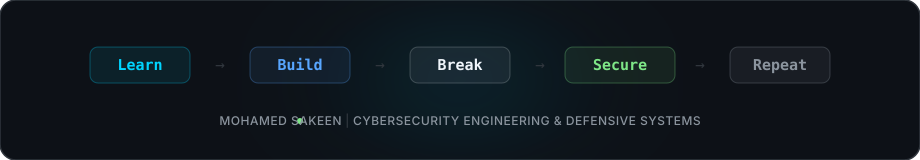

<div align="center">

<!-- HERO BANNER -->


<br/><br/>

<!-- QUICK LINKS BADGES -->
<p align="center">
  <a href="https://www.linkedin.com/in/mohamedsakeen77/" target="_blank">
    
  </a>
  &nbsp;
  <a href="https://portfolio-yjzi.onrender.com/" target="_blank">
    
  </a>
  &nbsp;
  <a href="mailto:mohamedsakeen09@gmail.com">
    
  </a>
  &nbsp;
  <a href="https://github.com/MohamedSakeen">
    
  </a>
</p>

</div>

---

### 🎯 Current Focus & Specialized Interests

<table width="100%">
  <tr>
    <td width="33%" valign="top">
      <h4>🛡️ Defensive Security</h4>
      <ul>
        <li><b>SOC Operations</b> — Security Operations Center workflows</li>
        <li><b>Detection Engineering</b> — Custom SIGMA &amp; YARA rules</li>
        <li><b>Threat Hunting</b> — Proactive adversary detection</li>
      </ul>
    </td>
    <td width="33%" valign="top">
      <h4>🔐 Architecture & Cloud</h4>
      <ul>
        <li><b>Zero Trust Architecture</b> — Continuous verification</li>
        <li><b>Cloud Security</b> — Infrastructure protection &amp; IAM</li>
        <li><b>Industrial Security</b> — OT &amp; ICS defense frameworks</li>
      </ul>
    </td>
    <td width="33%" valign="top">
      <h4>🧠 Engineering & Research</h4>
      <ul>
        <li><b>Reverse Engineering</b> — Binary analysis &amp; Ghidra</li>
        <li><b>Modern Cryptography</b> — Applied encryption protocols</li>
        <li><b>Data Structures &amp; Algorithms</b> — High efficiency logic</li>
      </ul>
    </td>
  </tr>
</table>

---

### 💻 Technology Stack & Security Matrix

<div align="center">
  
</div>

<br/>

<details>
<summary><b>🔍 View Categorized Skill Badges</b></summary>

<br/>

#### Languages
<p>
  
  
  
  
  
  
</p>

#### Web Engineering
<p>
  
  
  
  
  
</p>

#### Operating Systems & Environments
<p>
  
  
  
  
</p>

#### Security & Analysis Tools
<p>
  
  
  
  
  
  
  
  
  
  
  
</p>

#### SIEM & Telemetry
<p>
  
  
  
  
</p>

</details>

---

### 📈 Learning & Evolution Timeline

<div align="center">
  
</div>

---

### 🏆 Certifications & Key Achievements

<table width="100%">
  <tr>
    <td width="50%" valign="top">
      <h4>📜 Certifications</h4>
      <ul>
        <li><b>Google Cybersecurity Professional Certificate</b></li>
        <li><b>Cisco Ethical Hacker</b></li>
        <li><b>Cisco CCNA</b> (Cisco Certified Network Associate)</li>
        <li><b>EC-Council CEH</b> (Certified Ethical Hacker)</li>
        <li><b>HackerRank Python Certificate</b></li>
      </ul>
    </td>
    <td width="50%" valign="top">
      <h4>🥇 Key Achievements</h4>
      <ul>
        <li><b>🥋 World Karate Champion</b></li>
        <li><b>🥋 Black Belt</b> in Karate</li>
        <li><b>💻 350+ SkillRack Problems Solved</b></li>
        <li><b>🏁 Active CTF Competitor</b> (TryHackMe / HTB / PicoCTF)</li>
        <li><b>🔬 Cybersecurity Research</b> in Defensive Systems</li>
      </ul>
    </td>
  </tr>
</table>

---

### 🟩 Contribution Graph

<div align="center">
  
</div>

---

### 💡 Engineering & Learning Philosophy

> *"Curiosity drives discovery. I focus on understanding systems down to their core mechanics, breaking them safely in controlled sandbox environments, extracting technical insights, and engineering resilient defensive solutions."*

```text
  Learn  ➔  Build  ➔  Break  ➔  Secure  ➔  Repeat
```

---

### 🤝 Connect & Collaborate

<p align="center">
  Interested in cybersecurity engineering, threat detection, or open-source defense tools? Let's connect!
</p>

<p align="center">
  <a href="https://www.linkedin.com/in/mohamedsakeen77/" target="_blank">
    
  </a>
  &nbsp;&nbsp;
  <a href="https://portfolio-yjzi.onrender.com/" target="_blank">
    
  </a>
  &nbsp;&nbsp;
  <a href="mailto:mohamedsakeen09@gmail.com">
    
  </a>
</p>

<br/>

<!-- FOOTER SVG -->
<div align="center">
  
</div>
